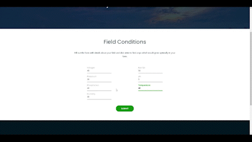

# hthacks
## The Problem

 According to our research, the current farming system has significant faults. When a farmer invests his time and money in his plot, he expects to see big returns on both his investment and profit; however, this does not happen when the crops fail. 
One of the most common causes of agricultural failure is people planting crops that aren't fit for a certain field in the hopes of getting a lot of money, but what happens instead is the exact reverse. 

Almost every year, at least 15-25 percent of potential crop production is lost, at a time when India needs to increase production while simultaneously ensuring food security and nutrition to meet its expanding consumption needs.

In a country like India, where agriculture employs more than half of the people, it is critical that the industry be made as resilient and problem-free as possible.

Now, delving deeper into the issue, The Hindu daily reports that 60 percent of Indian farmers may face catastrophic losses in 2020.

It is well known that some farmers are unable to plant crops for a few seasons due to a number of variables such as soil conditions, weather, and so on, and that they occasionally end up planting crops that are not suitable for their land. 

If they are made aware of the favourable crops and other conditions, they can have a very fruitful harvest.

## The Solution

 Our website, "FarmEasy," features two AI models that, based on specific inputs such as soil ph, humidity, temperature, and other factors, estimate the best crops for a certain area as well as the best fertilisers. Not only that, but our website also offers the opportunity to buy high-quality seeds online. This saves a significant amount of time and work. 

## Techonology Used 

 <i> For the AI-Models </i> 

<ul>
  <li> Logistic Regression </li>
  <li> Decision Tree </li>
  <li> K-Neighbours </li>

</ul>
etc. 

 <i> For the Website </i> 

<ul> 
  <li>HTML</li>
  <li> CSS</li>
  <li>FastAPI </li>
  <li> BootStrap </li>
</ul>

## Demonstration 

The website can be accessed from < a href= "https://farmeasycrops.herokuapp.com/"> here. </a> 

  

<b> <u>This project has been made for  High Tech Hacks 2.0 organised by the Society of Hispanic Professional Engineers of High Tech High School, Secaucus, New Jersey.  </u> </b> 
